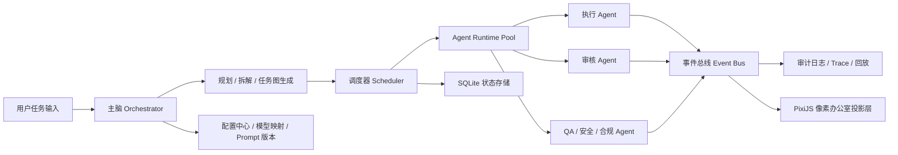

# 企业级多 Agent 像素办公室应用规划

## 1. 目标定义

目标是开发一个 Windows `exe` 桌面应用。用户发布任务后，系统中的“主大脑”负责：

- 理解任务与目标
- 自动规划需要多少个 Agent
- 为每个 Agent 绑定明确身份、职责与模型档位
- 将任务拆分到足够细的原子任务
- 在最多 100 个 Agent 的上限内并发执行
- 通过审核、合规、测试、发布等角色形成完整闭环
- 在前端像素风办公室中以可视化方式展示每个 Agent 的行为、交接与状态

这个产品不是简单聊天界面，而是“可视化企业级 Agent 编排系统”。

## 2. 调研后的关键结论

### 2.1 是否直接魔改 `openai/swarm`

结论：不建议直接把 `openai/swarm` 当作代码底座魔改；建议把它当作“编排思想参考”，然后用 Go 重写执行内核。

原因：

- `openai/swarm` 官方仓库已经明确标注为“experimental, educational”。
- 该仓库明确写明：`Swarm is now replaced by the OpenAI Agents SDK`，并建议生产场景迁移到 Agents SDK。
- `openai/swarm` 是 Python 项目，而你的目标是 Go + Windows `exe` + 像素风实时可视化桌面应用，直接继承原代码的收益很低。
- 官方 Go 侧当前公开、稳定的能力核心是 `openai-go` + `Responses API` + tool calling + structured outputs，更适合我们自己写调度器、状态机、审计系统和 UI 事件投影层。

因此，本项目的正确姿势是：

1. 参考 `Swarm` 的 `Agent` / `handoff` 思想。
2. 吸收 `Agents SDK` 的 `guardrails`、`human-in-the-loop`、`sessions`、`tracing` 等生产思路。
3. 在 Go 中实现自己的企业级 orchestration runtime。

### 2.2 客户端技术路线

结论：桌面壳层使用 `Wails`，前端场景渲染使用 `PixiJS`，而不是纯 Go 游戏引擎一把梭。

原因：

- `Wails` 原生就是 Go + Web 技术开发桌面应用，适合输出 Windows `exe`。
- `Wails` 支持 Go 与前端双向调用，适合“调度内核在 Go，像素场景在前端”的分层设计。
- `PixiJS` 的 Sprite / Container / NineSlice / 性能优化能力很适合像素办公室场景、人物动画、抽屉、浮层与交接动画。
- 纯游戏引擎路线虽然也能做场景，但会把设置页、表单、日志、配置、版本管理、审批面板做得很重，不如 Wails + 前端 UI 体系平衡。

### 2.3 企业流程设计原则

结论：必须采用“确定性流程骨架 + 动态 Agent 编排”的混合架构。

也就是：

- 是否创建任务、哪些阶段必须执行、哪些阶段必须审批，这些是确定的。
- 具体某阶段内部怎么拆分、派多少执行 Agent、调用哪些工具，这些允许动态规划。

这样才能同时满足：

- 企业流程可控
- Agent 执行灵活
- 审计追踪完整
- 失败可恢复
- 高并发可调度

## 3. 产品愿景与边界

### 3.1 产品愿景

用户提交一个复杂任务后，系统像一家像素风办公室：

- 总控 Agent 接单
- 规划 Agent 开会拆解任务
- 执行 Agent 在工位工作
- 审核 Agent 来回检查
- 资料在 Agent 之间传递
- 出现阻塞时有人升级上报
- 用户可以点开任意 Agent 看它正在做什么

最终形成一个“看得见、管得住、能审计”的 Agent 公司。

### 3.2 非目标

第一阶段先不追求：

- 跨机器分布式集群
- 云端多人协作
- 多租户 SaaS 管理后台
- 完整 BPMN 可视化建模器
- 任意第三方模型的深度统一适配

第一阶段聚焦：

- 本地桌面版可运行
- 单机最多 100 Agent 并发
- 完整任务 DAG、审核流、审计流
- 像素办公室可视化 MVP

## 4. 总体架构



## 5. 技术选型

## 5.1 桌面与前端

- 桌面壳：`Wails`
- 前端框架：`React + TypeScript`
- 场景渲染：`PixiJS`
- UI 组件层：轻量自定义组件，不走厚重企业 UI 库
- 像素资产管线：`Aseprite` + `Tiled`

说明：

- `Wails` 负责打包 `exe`、窗口、系统菜单、Go/JS bridge。
- `React` 负责设置页、抽屉、日志面板、审批面板、历史回放等常规界面。
- `PixiJS` 负责办公室地图、工位、Agent 小人、电脑动画、文件夹交接、路径移动。
- `Aseprite` 负责角色和物件 spritesheet 输出。
- `Tiled` 负责办公室 tilemap、碰撞层、座位区、走廊区、会议室区、审批区。

## 5.2 Go 后端

- 主语言：`Go 1.22+`
- OpenAI SDK：`openai-go`
- 本地存储：`SQLite`
- 事件分发：Go channel + 内部事件总线
- 配置文件：`YAML` 或 `TOML`
- 结构化输出：基于 `Responses API` JSON Schema
- 流式回调：基于 `Responses API` streaming

数据库建议优先使用不依赖 CGO 的 SQLite 驱动，以降低 Windows 打包复杂度。

## 5.3 为什么不用这些方案做底座

- 直接魔改 `openai/swarm`：Python 基座与最终 Go 产品方向冲突。
- 纯 Electron：Go 不是一等公民。
- 纯 Ebitengine：像素场景强，但配置后台、抽屉、日志、审批 UI 的开发效率不理想。
- 直接上 Temporal / Camunda：如果第一阶段就是本地单机 `exe`，会明显过重；它们更适合未来服务化版本参考。

## 6. 核心设计原则

### 6.1 确定性骨架，动态执行内核

流程大关卡固定：

- 接单
- 风险评估
- 规划
- 任务拆分
- 并发执行
- 审核
- 汇总
- 最终审批
- 输出归档

阶段内部允许动态：

- 需要多少执行 Agent
- 哪些任务并发
- 哪些任务转交
- 哪些任务升级人工

### 6.2 所有任务必须拆成“原子任务”

原子任务定义：

- 只有一个直接负责人
- 输入明确
- 输出明确
- 验收标准明确
- 工具边界明确
- 可以单独审核
- 可以单独重试

如果任务不满足这些条件，就继续拆分。

### 6.3 所有关键动作必须可审计

必须记录：

- 谁创建了任务
- 主脑为什么这样拆
- 某个 Agent 为什么接到此任务
- 用了哪个模型
- Prompt 版本是什么
- 调了什么工具
- 产生了哪些中间资料
- 谁审核通过/拒绝
- 为什么重试 / 升级 / 回退

### 6.4 审核不是装饰，而是硬门禁

涉及下面场景必须进入审核门：

- 高成本调用
- 敏感工具调用
- 最终输出对外发布
- 代码变更
- 可能影响系统状态的操作
- 低置信度结果

## 7. Agent 体系设计

不是每次都固定生成 100 个不同角色，而是基于“角色原型池”动态生成实例。

## 7.1 核心角色原型

### A. 主脑与规划层

1. `Chief Orchestrator`
作用：接收用户任务，启动整条任务链，决定是否进入标准企业流程模板。

2. `Intake Analyst`
作用：补全任务上下文、识别目标、风险、领域、优先级、截止时间。

3. `Solution Planner`
作用：生成整体方案、阶段划分、资源规划。

4. `Task Decomposer`
作用：将阶段任务递归拆成原子任务。

5. `Dependency Graph Builder`
作用：把原子任务构造成 DAG，标注依赖、前置、并发组、汇聚点。

6. `Staffing Planner`
作用：根据任务图决定要实例化多少个 Agent、每个 Agent 用什么模型档位。

### B. 执行层

7. `Research Agent`
作用：查资料、收集证据、形成输入资料包。

8. `Implementation Agent`
作用：执行代码、文案、数据处理、脚本生成、接口调用等任务。

9. `Tool Operator Agent`
作用：专门负责调用高风险或复杂工具链。

10. `Integrator Agent`
作用：把多个执行结果合并成统一交付件。

### C. 审核与质量层

11. `Peer Reviewer`
作用：对执行结果做同行复核。

12. `QA Verifier`
作用：做测试、验收、边界情况检查。

13. `Security Reviewer`
作用：检查敏感信息、工具调用风险、权限越界。

14. `Compliance Reviewer`
作用：检查是否符合预设公司流程、政策或输出规范。

15. `Fact Checker`
作用：校验关键事实、引用和结论是否可靠。

### D. 风险与升级层

16. `Risk Controller`
作用：风险打分、触发审批门、决定是否升级人工。

17. `Escalation Manager`
作用：处理阻塞、超时、冲突审核、长尾问题。

18. `Human Approval Proxy`
作用：把必须人工批准的动作转成待审批事项。

### E. 收口层

19. `Delivery Manager`
作用：整合最终输出、生成摘要、交付格式化。

20. `Audit Recorder`
作用：沉淀全链路日志、证据、Prompt 版本、审批记录。

## 7.2 模型档位设计

建议不要把角色和具体模型名称强绑定，而是先定义“模型档位”，在设置页里映射到具体模型。

建议档位：

1. `tier-strategic`
用途：主脑、规划、复杂审核
特点：高推理、高成本、低并发占比

2. `tier-review`
用途：审核、QA、安全、合规
特点：高稳定、高结构化输出

3. `tier-execution`
用途：大多数执行 Agent
特点：较快、性价比高、支持工具调用

4. `tier-routing`
用途：分类、分流、风险初筛
特点：低成本、低延迟

5. `tier-vision`
用途：处理截图、图像、UI 资产时可选
特点：按需启用

默认绑定策略：

- 主脑 / Planner / 架构 / 复杂审核：`tier-strategic`
- 普通 Reviewer / QA / Security：`tier-review`
- 执行 Agent：`tier-execution`
- 分类与风控初筛：`tier-routing`

这个设计能让你在设置页里替换供应商或模型，而不改业务代码。

## 8. 任务拆解与任务图设计

## 8.1 拆解策略

采用两段式拆解：

1. 宏观拆解
将用户任务拆成阶段：
需求澄清 -> 规划 -> 执行 -> 审核 -> 汇总 -> 交付

2. 微观拆解
将每个阶段进一步拆成原子任务，直到满足原子任务定义

## 8.2 原子任务数据结构

建议核心结构：

```go
type TaskNode struct {
    ID                 string
    ParentID           string
    Title              string
    Goal               string
    Inputs             []ArtifactRef
    Outputs            []ArtifactContract
    Dependencies       []string
    Role               AgentRole
    ModelTier          ModelTier
    Priority           int
    RiskLevel          RiskLevel
    AcceptanceCriteria []string
    ReviewPolicy       ReviewPolicy
    RetryPolicy        RetryPolicy
    SLASeconds         int
    Status             TaskStatus
}
```

## 8.3 拆解停止条件

满足以下全部条件才停止继续拆：

- 单任务预计执行时间在可控范围内
- 单任务只需一个主责任 Agent
- 产出物可以独立审核
- 若失败可以独立重试
- 不再包含“并且”“然后再”“顺便”这类复合动作

## 8.4 任务依赖图

任务图采用 DAG，而不是简单队列。

原因：

- 允许大规模并发
- 允许局部失败重试
- 允许审核插在中间
- 允许多个结果汇聚后再进入下一阶段

## 9. 并发与调度设计

## 9.1 并发上限

全局硬上限：100 个 Agent 实例同时运行。

但不建议所有 100 个都是执行 Agent，应该保留审核和风险处理容量。

建议默认配额：

- 主脑与规划：1-5
- 执行：最多 70
- 审核：最多 15
- QA / 安全 / 合规：最多 10
- 风险 / 升级 / 汇总：最多 5

总和不超过 100。

## 9.2 调度器策略

调度器采用：

- DAG 就绪队列
- 全局 semaphore 限流
- 按角色配额的 worker pool
- 优先级队列
- 风险等级插队
- 审核保留槽位

这可以避免执行 Agent 把所有并发占满，导致审核堵死。

## 9.3 失败与重试

每个任务节点独立管理：

- 最大重试次数
- 指数退避
- 是否允许换模型档位重试
- 是否升级到 Reviewer / Human

## 9.4 挂起与恢复

必须支持：

- 应用关闭后恢复运行状态
- 人工审批等待后恢复
- API 短暂失败后恢复
- 某个 Agent 异常退出后重新派发

因此运行状态必须持久化到本地存储，而不能只放内存。

## 10. 企业级流程门禁

## 10.1 标准流程模板

建议内置一条默认企业流程：

1. 输入检查
2. 风险分类
3. 任务规划
4. 任务拆解
5. 分配执行
6. 同行审核
7. QA 验证
8. 安全 / 合规复核
9. 汇总交付
10. 最终批准
11. 审计归档

## 10.2 Guardrail Sandwich

参考生产级 Agent 设计思路，执行前后都要加护栏：

- 前护栏：输入风险、敏感词、任务合法性、成本预估
- 执行 Agent：真正完成工作
- 后护栏：事实校验、格式校验、合规校验、输出风险校验

## 10.3 Human in the Loop

必须支持人工审批的中断式流程，至少覆盖：

- 敏感工具调用
- 高风险输出发布
- 删除/覆盖类操作
- 成本超预算
- 审核意见冲突

## 10.4 Prompt Versioning

每个角色的 prompt 必须版本化：

- `role`
- `version`
- `effective_from`
- `change_note`
- `risk_profile`

这样后期才能追踪“为什么这一次的主脑拆分策略和上周不同”。

## 11. 审计与可观测性

## 11.1 事件总线

所有运行时动作统一发事件：

- `run.created`
- `plan.generated`
- `task.created`
- `task.ready`
- `agent.spawned`
- `agent.started`
- `tool.called`
- `artifact.produced`
- `handoff.created`
- `review.requested`
- `review.passed`
- `review.rejected`
- `approval.waiting`
- `approval.granted`
- `task.failed`
- `task.retried`
- `run.completed`

## 11.2 Trace 维度

每个事件都要带：

- `run_id`
- `task_id`
- `agent_id`
- `role`
- `model_tier`
- `prompt_version`
- `started_at`
- `ended_at`
- `cost_estimate`
- `token_usage`
- `parent_span_id`

## 11.3 可回放

办公室 UI 不只要“实时看”，还要支持：

- 回放一次完整任务执行过程
- 看每个 Agent 的历史轨迹
- 看哪些资料什么时候交接
- 看是谁卡住了流程

## 12. 像素办公室前端规划

## 12.1 视觉方向

建议统一风格：

- 俯视角或斜 3/4 视角像素办公室
- 有工位、会议室、审核区、服务器角、档案区、发布台
- 限制色板，统一像素比例，统一边框、按钮和抽屉风格
- UI 与场景共享一套品牌色和像素字体

不建议：

- 一半像素风、一半普通后台风
- 场景很游戏化，右侧面板却很现代企业 SaaS 风

要做成统一美术语言。

## 12.2 场景分层

PixiJS 层次建议：

1. 背景层：地板、墙面、走廊
2. 静态物件层：桌子、电脑、柜子
3. Agent 层：人物、文件夹、移动路径
4. 特效层：光标闪烁、电脑屏幕、状态气泡
5. 交互层：点击热区
6. UI Overlay：右侧抽屉、顶部控制条、底部日志条

## 12.3 Agent 可视状态

每个 Agent 至少有这些动画状态：

- `idle`：待命
- `thinking`：坐在工位前，电脑闪动
- `typing`：键盘工作状态
- `moving`：走向另一个位置
- `handoff`：手持资料夹递交给目标 Agent
- `reviewing`：放大镜/盖章/检查动作
- `blocked`：气泡或红色提示
- `waiting_approval`：停在审批区
- `done`：完成回座位或进入归档区

## 12.4 抽屉内容

点击 Agent 右侧弹出抽屉，展示：

- Agent 名称
- 角色
- 当前状态
- 当前任务 ID / 标题
- 当前模型档位
- 当前输入资料
- 当前输出进度
- 最近一次工具调用
- 风险等级
- 审核状态
- 历史操作时间线

## 12.5 资料交接动画

资料不只是抽象事件，应该是场景内有形对象：

- 生成 `artifact` 后，在 Agent 身上出现文件夹/信封/芯片盒
- Agent 沿路径走向下一个 Agent
- 到达后播放交付动作
- 目标 Agent 接收后开始工作

这会让“handoff”可视化，非常贴合你的产品核心卖点。

## 12.6 性能策略

最多 100 Agent 时，前端必须注意性能：

- 办公室背景层缓存为纹理
- 静态容器尽量 `cacheAsTexture`
- 可交互 Agent 使用常规 `Sprite/Container`
- 粒子系统只用于少量环境特效，不用于主交互 Agent
- 视口外对象做裁剪
- 动画帧率分级，非焦点 Agent 降频更新

## 13. 设置中心设计

设置中心必须不是附属页面，而是产品核心能力。

至少包含：

### 13.1 模型设置

- 每个模型档位绑定哪个供应商 / 模型
- 温度、最大 token、推理强度
- 是否允许自动降级

### 13.2 并发设置

- 总并发上限
- 各角色池配额
- 单任务最大并发
- 队列长度阈值

### 13.3 流程设置

- 哪些任务类型必须人工审批
- 哪些任务需要 QA
- 哪些任务需要 Security / Compliance
- 审核拒绝后的策略

### 13.4 成本与安全设置

- 单任务预算
- 日预算
- 高成本模型白名单
- 敏感工具审批规则

### 13.5 视觉设置

- 场景主题
- 缩放倍数
- 像素字体
- 是否显示路径线、气泡、详细日志

### 13.6 存储与审计设置

- 项目目录
- 日志保留天数
- 审计导出
- 是否启用自动快照

## 14. 推荐目录结构

```text
/
  cmd/app/
  internal/
    app/
    orchestrator/
    planner/
    decomposer/
    scheduler/
    runtime/
    agents/
    review/
    approvals/
    guardrails/
    artifacts/
    audit/
    storage/
    config/
    eventbus/
    projection/
  frontend/
    src/
      app/
      scene/
      ui/
      drawers/
      panels/
      store/
      events/
      assets/
        sprites/
        tiles/
        fonts/
        ui/
  docs/
```

## 15. 第一阶段开发范围建议

## 15.1 Phase 1: 骨架搭建

目标：先把最小闭环跑通。

包含：

- Wails 项目初始化
- React + PixiJS 前端骨架
- Go 调度内核骨架
- SQLite 持久化骨架
- 事件总线
- 一个最小任务流：主脑 -> 拆解 -> 2 个执行 Agent -> 1 个 Reviewer -> 汇总

## 15.2 Phase 2: 企业流程骨架

包含：

- 风险分类
- 审核门
- QA / Security Reviewer
- 人工审批挂起与恢复
- Prompt 版本化
- Trace / 审计日志

## 15.3 Phase 3: 像素办公室 MVP

包含：

- 办公室地图
- Agent 小人生成
- 工位状态动画
- 抽屉
- 资料交接动画
- 任务时间线

## 15.4 Phase 4: 100 并发与稳定性

包含：

- 并发池
- 限流
- 超时与重试
- 性能优化
- 崩溃恢复
- 回放模式

## 15.5 Phase 5: 产品化

包含：

- 设置中心完善
- 主题与资产统一
- 安装包输出
- 审计导出
- 模板化流程

## 16. 核心风险与应对

### 风险 1：100 并发时 API 成本与速率限制压力大

应对：

- 角色池限额
- 模型档位分层
- 预算门禁
- 自动降级到 cheaper tier

### 风险 2：任务拆得太粗导致审核失效

应对：

- 原子任务标准
- 拆解后自动做“颗粒度检查”
- Reviewer 可退回重拆

### 风险 3：像素场景太酷，但实际不可用

应对：

- 右侧抽屉和底部日志必须完整
- 场景负责“看懂状态”
- 面板负责“看懂细节”

### 风险 4：运行时状态丢失

应对：

- 事件持久化
- 任务状态机持久化
- 审批中断可恢复

### 风险 5：直接照搬 `Swarm` 导致架构不贴合 Go

应对：

- 只借鉴 agent handoff 思想
- Go 侧全部按本地桌面产品重构

## 17. 我的明确建议

建议我们按下面路径推进：

1. 不直接 fork `openai/swarm` 作为产品底座。
2. 以它和 `Agents SDK` 为方法参考，Go 自研 orchestration runtime。
3. 技术栈定为：`Go + Wails + React + PixiJS + SQLite`。
4. 第一阶段先完成“最小企业流程闭环 + 办公室可视化 MVP”。
5. 在骨架稳定后，再扩展到 100 并发、更多角色和更复杂审批策略。

## 18. 下一步开发建议

如果进入下一阶段开发，我建议立即按以下顺序开工：

1. 初始化 Wails + React + PixiJS 工程
2. 建立 Go 侧配置、事件总线、存储与任务状态机
3. 实现主脑 / 拆解 / 执行 / 审核的最小闭环
4. 打通前端办公室场景和事件投影
5. 再补审批、QA、安全、回放与设置中心

## 19. 调研来源

以下是本次规划直接参考的公开资料：

- OpenAI Swarm 仓库：[https://github.com/openai/swarm](https://github.com/openai/swarm)
- OpenAI Agents SDK 文档：[https://openai.github.io/openai-agents-python/](https://openai.github.io/openai-agents-python/)
- OpenAI Agents SDK Guardrails：[https://openai.github.io/openai-agents-js/guides/guardrails/](https://openai.github.io/openai-agents-js/guides/guardrails/)
- OpenAI Agents SDK Tracing：[https://openai.github.io/openai-agents-js/guides/tracing/](https://openai.github.io/openai-agents-js/guides/tracing/)
- OpenAI Agents SDK Human in the Loop：[https://openai.github.io/openai-agents-python/human_in_the_loop/](https://openai.github.io/openai-agents-python/human_in_the_loop/)
- OpenAI Agents SDK Sessions：[https://openai.github.io/openai-agents-python/sessions/](https://openai.github.io/openai-agents-python/sessions/)
- OpenAI Go SDK 仓库：[https://github.com/openai/openai-go](https://github.com/openai/openai-go)
- Wails 文档：[https://wails.io/docs/next/introduction/](https://wails.io/docs/next/introduction/)
- Wails Windows 指南：[https://wails.io/zh-Hans/docs/next/guides/windows/](https://wails.io/zh-Hans/docs/next/guides/windows/)
- PixiJS Sprite 文档：[https://pixijs.com/8.x/guides/components/scene-objects/sprite](https://pixijs.com/8.x/guides/components/scene-objects/sprite)
- PixiJS Container 文档：[https://pixijs.com/8.x/guides/components/scene-objects/container](https://pixijs.com/8.x/guides/components/scene-objects/container)
- PixiJS NineSlice 文档：[https://pixijs.com/8.x/guides/components/scene-objects/nine-slice-sprite](https://pixijs.com/8.x/guides/components/scene-objects/nine-slice-sprite)
- PixiJS ParticleContainer 文档：[https://pixijs.com/8.x/guides/components/scene-objects/particle-container](https://pixijs.com/8.x/guides/components/scene-objects/particle-container)
- Tiled 文档：[https://doc.mapeditor.org/en/stable/](https://doc.mapeditor.org/en/stable/)
- Aseprite CLI 文档：[https://www.aseprite.org/docs/cli/](https://www.aseprite.org/docs/cli/)
- Camunda Agentic Orchestration 设计：[https://docs.camunda.io/docs/components/agentic-orchestration/ao-design/](https://docs.camunda.io/docs/components/agentic-orchestration/ao-design/)
- Camunda Workflow Patterns：[https://docs.camunda.io/docs/components/concepts/workflow-patterns/](https://docs.camunda.io/docs/components/concepts/workflow-patterns/)

## 20. 备注

以下内容属于结合资料后的设计推断，不是某个单一来源直接给出的结论：

- “Go 自研编排层 + Wails + PixiJS” 是针对你的产品形态做出的工程判断。
- “角色原型池 + 动态实例化” 是为兼顾 100 并发和企业流程而设计的运行模式。
- “像素办公室 + 审核流 + 企业门禁”的整合方式，是在多个资料基础上形成的产品方案，不是现成开源项目直接提供的。
